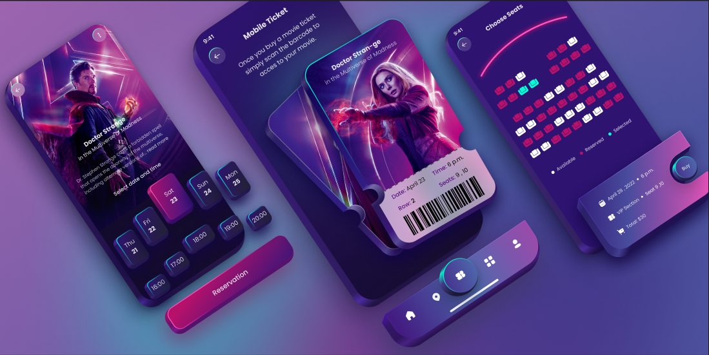

# 🎬 CineBook — Movie Ticket Booking App
## UX Case Study

---


## 1. Problem Statement

**Traditional movie ticket booking is frustrating.** Users face long queues at theaters, cluttered booking interfaces on existing platforms, and a lack of visual clarity when selecting seats, showtimes, and formats. Most existing apps prioritize ads and upselling over a smooth user experience, leading to **high drop-off rates during checkout** and **poor post-booking experiences** (lost tickets, no barcode access, etc.).

**CineBook** solves this by offering a visually immersive, frictionless mobile-first experience — letting users discover, book, and access movie tickets in under 60 seconds.

---

## 2. Target Users

| Persona | Description |
|---------|-------------|
| **Gen-Z Movie Buffs (18–25)** | Frequent moviegoers (2–4 times/month). Prefer mobile-first experiences, dark themes, and quick checkout. Value aesthetics and social sharing. |
| **Working Professionals (25–35)** | Weekend moviegoers who book in advance. Want quick date/time selection, seat preference memory, and digital tickets for convenience. |
| **Families (30–45)** | Occasional viewers who book multiple seats. Need clear seat maps, easy group booking, and child-friendly filters. |
| **Casual Viewers (all ages)** | Spontaneous users who decide last-minute. Need real-time availability, nearby theaters, and instant booking. |

---

## 3. User Pain Points

| # | Pain Point | Impact |
|---|-----------|--------|
| 1 | **Cluttered UI** — Existing apps (BookMyShow, Fandango) overload screens with ads, offers, and irrelevant content | Users feel overwhelmed → higher bounce rate |
| 2 | **Confusing seat selection** — Tiny seat maps, unclear availability indicators, no section differentiation (VIP/Standard) | Wrong seat selection → refund requests, frustration |
| 3 | **Too many steps to checkout** — Movie → Theater → Date → Time → Seats → Food → Payment = 7+ steps | High drop-off at checkout (~40% abandonment) |
| 4 | **No mobile ticket** — Users still screenshot QR codes or carry printed tickets | Lost tickets at theater entrance, wasted time |
| 5 | **Poor showtime browsing** — Hard to compare times across dates, no visual calendar | Users switch to competitor apps for better UX |
| 6 | **No personalization** — Same experience for everyone regardless of viewing history | Missed opportunity for recommendations and repeat bookings |

---

## 4. Goals of the Product

### Business Goals
- Achieve **< 3-step booking flow** (select → seat → pay)
- Reduce checkout abandonment to **< 15%**
- Increase **repeat booking rate** by 30% through better UX
- Drive **digital ticket adoption** to 95%+ (zero paper tickets)

### User Goals
- Discover and book a movie in **under 60 seconds**
- Clearly see available seats with **section-level pricing** (VIP, Standard)
- Access a **scannable mobile ticket** instantly after booking
- Get **personalized movie recommendations** based on viewing history

### Design Goals
- Immersive, cinema-inspired **dark theme** with bold visuals
- **Minimal cognitive load** — progressive disclosure, one action per screen
- Smooth **micro-animations** for transitions and feedback
- Accessible seat map with **color-coded availability** (Available / Selected / Reserved)

---

## 5. Key Features

### 🎬 Movie Discovery
- Hero card with movie poster, title, genre, rating, and synopsis
- Swipeable date picker with calendar-style chips
- Showtime grid with format tags (2D, 3D, IMAX, 4DX)

### 🎟️ Smart Seat Selection
- Interactive theater seat map with real-time availability
- Color-coded seats:
  - ⬜ **Grey** = Available
  - 🟩 **Green** = Selected (by user)
  - 🟥 **Red** = Reserved (already booked)
- Section labels (VIP, Standard) with per-section pricing
- Pinch-to-zoom on seat map for large theaters

### 📱 Mobile Ticket
- Instant digital ticket generation after payment
- **Scannable barcode** for theater entry
- Ticket card showing: Movie, Date, Time, Seats, Row, Section
- Save to Apple Wallet / Google Pay
- Share ticket via WhatsApp/Instagram

### 🎬 Reservation Flow
- "Reservation" CTA with animated button feedback
- Date → Time selection on a single screen (no page jumps)
- Quick checkout with saved payment methods
- Booking confirmation with haptic feedback

### 🔔 Post-Booking
- Push notification reminders (2 hours before showtime)
- Directions to theater via Maps integration
- Rate & review prompt after the movie

---

## 6. User Flow

```
┌─────────────────────────────────────────────────────────┐
│                      USER OPENS APP                      │
└───────────────────────────┬─────────────────────────────┘
                            │
                            ▼
              ┌─────────────────────────┐
              │    Browse / Search       │
              │    for a Movie           │
              └────────────┬────────────┘
                           │
                           ▼
              ┌─────────────────────────┐
              │    Movie Details Page    │
              │  (Poster, Synopsis,      │
              │   Rating, Trailer)       │
              └────────────┬────────────┘
                           │
                           ▼
              ┌─────────────────────────┐
              │   Select Date & Time     │
              │  (Calendar chips +       │
              │   Showtime grid)         │
              └────────────┬────────────┘
                           │
                           ▼
              ┌─────────────────────────┐
              │    Choose Seats          │
              │  (Interactive seat map,  │
              │   VIP/Standard toggle)   │
              └────────────┬────────────┘
                           │
                           ▼
              ┌─────────────────────────┐
              │    Booking Summary       │
              │  + Payment               │
              │  (UPI / Card / Wallet)   │
              └────────────┬────────────┘
                           │
                           ▼
              ┌─────────────────────────┐
              │  ✅ Confirmation +       │
              │  Mobile Ticket           │
              │  (Barcode for entry)     │
              └─────────────────────────┘
```

### Flow Summary
| Step | Screen | Primary Action |
|------|--------|---------------|
| 1 | Home / Search | Find a movie |
| 2 | Movie Details | View info, select date & time |
| 3 | Seat Selection | Pick seats on interactive map |
| 4 | Checkout | Review & pay |
| 5 | Ticket | View/scan mobile ticket |

**Total steps: 5** (vs. 7–8 in competitor apps)

---

## 7. Metrics to Track

### Conversion Metrics
| Metric | Definition | Target |
|--------|-----------|--------|
| **Booking Conversion Rate** | % of app opens that result in a completed booking | > 25% |
| **Checkout Completion Rate** | % of users who reach payment and complete it | > 85% |
| **Seat Selection → Checkout** | % of users who select seats and proceed to pay | > 90% |

### Drop-Off Metrics
| Metric | Definition | Action if High |
|--------|-----------|----------------|
| **Movie Detail → Date/Time Drop-off** | Users leave before selecting showtime | Improve showtime visibility, add "Fastest Available" option |
| **Seat Selection Drop-off** | Users leave the seat map without selecting | Simplify seat map, add "Best Available" auto-select |
| **Payment Drop-off** | Users abandon at checkout | Add more payment options, save cards, reduce form fields |
| **Funnel Drop-off Rate** | % lost at each step of the booking flow | Identify and fix the weakest step |

### Engagement Metrics
| Metric | Definition | Target |
|--------|-----------|--------|
| **Time to Book** | Average seconds from app open to booking confirmation | < 60 seconds |
| **Repeat Booking Rate** | % of users who book again within 30 days | > 35% |
| **Mobile Ticket Scan Rate** | % of tickets scanned at theater (vs. counter pickup) | > 95% |
| **App Session Duration** | Average time spent per session | 3–5 minutes |
| **NPS (Net Promoter Score)** | User satisfaction survey score | > 50 |

### Technical Metrics
| Metric | Definition | Target |
|--------|-----------|--------|
| **App Load Time** | Time to first meaningful paint | < 2 seconds |
| **Seat Map Render Time** | Time to load interactive seat map | < 1 second |
| **Payment Success Rate** | % of payment attempts that succeed | > 98% |
| **Crash Rate** | % of sessions that crash | < 0.5% |

---

## 8. Design Decisions

### Why Dark Theme?
- Mirrors the **cinema experience** — immersive, premium feel
- Reduces eye strain during evening browsing (peak booking time: 6–10 PM)
- Makes **movie posters pop** against dark backgrounds
- Aligns with Gen-Z preference for dark mode interfaces

### Why Card-Based Date/Time Selection?
- **Reduces cognitive load** — users see dates as tappable chips, not a full calendar
- **One-screen selection** — date AND time on the same view (no page navigation)
- Visual hierarchy: selected date is highlighted with color contrast

### Why Barcode on Mobile Ticket?
- **Instant entry** — no counter queue, no paper
- **Offline access** — barcode works without internet at the theater
- **Shareable** — users can forward tickets to friends easily

---

## 9. Design Tools Used

- **Figma** — UI Design, Component library, Interactive prototyping
- **Adobe Photoshop** — Movie poster mockups and visual treatments

---

*Case study by: [Your Name]*
*Project Type: UI/UX Design — Mobile Application*
*Duration: [X weeks]*
